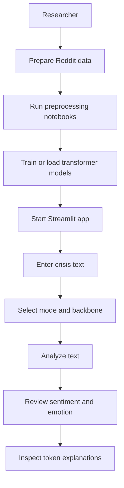
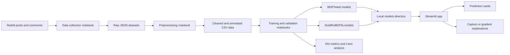
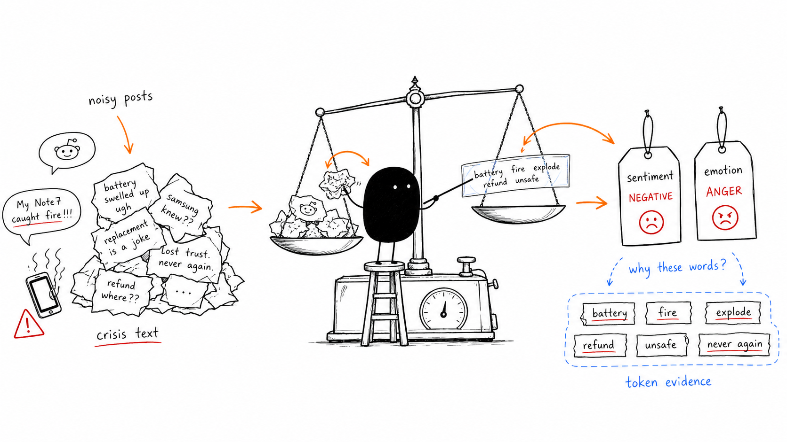

# AI Crisis Sentiment & Emotion Analyzer

An explainable NLP research prototype for analysing public sentiment and emotion during crisis communication events, using the Samsung Galaxy Note 7 crisis as the case study.

The repository combines Reddit data collection and preprocessing notebooks, transformer training/evaluation notebooks, explainability analysis, and a Streamlit demo app for single-text inference.

## Story Scenario

A crisis communication researcher is tracking how people react to a product safety incident. Reddit posts are moving quickly, and manual review cannot keep up with the volume or emotional nuance of the conversation.

This project gives the researcher a way to process crisis-related Reddit text, classify the sentiment and emotion behind each message, and inspect which words influenced the model prediction.

## Problem Statement

Public crisis response is often measured through broad positive, negative, or neutral sentiment. That misses useful signals such as fear, anger, sadness, surprise, and joy, especially when users discuss safety, recall logistics, brand trust, or product replacement issues.

For crisis communication analysis, the system needs to:

- Collect and clean noisy Reddit text.
- Label or use labelled examples for sentiment and emotion classification.
- Compare single-task and multi-task transformer approaches.
- Explain model predictions at the token level instead of returning only a class label.
- Provide a simple interface for testing crisis-related text.

## Solution

The project builds a research pipeline around transformer-based text classification:

- Reddit crisis discussion data is collected and flattened into JSON/CSV datasets.
- Text is cleaned with Reddit-specific preprocessing.
- Sentiment labels use `Negative`, `Neutral`, and `Positive`.
- Emotion labels use `Anger`, `Fear`, `Joy`, `Sadness`, `Surprise`, and `No Emotion`.
- BERTweet and DistilRoBERTa experiments compare single-task and multi-task learning setups.
- Captum-based attribution and gradient fallback logic expose important tokens for a prediction.
- A Streamlit app lets users enter text, choose model mode/backbone, view probability distributions, and inspect explanations.

## Product Concept

This is a research-facing crisis intelligence prototype rather than a production monitoring system.

Core experience:

- Enter a crisis-related social media sentence or paragraph.
- Choose `Single-task` or `Multi-task` inference.
- Choose `BERTweet` or `DistilRoBERTa`.
- Receive sentiment and emotion predictions with confidence scores.
- Review highlighted token importance, top explanatory terms, counterfactual checks, and probability charts.

Primary users:

- Crisis communication researchers.
- NLP students evaluating transformer models.
- Analysts studying public reaction to product safety incidents.

What makes the approach distinct:

- It evaluates both sentiment and emotion for the same crisis domain.
- It compares social-media-specialized and general transformer backbones.
- It includes explainability outputs so predictions can be interpreted instead of treated as opaque labels.

## User Flow



## System Architecture Flow



## Tech Stack

| Area | Tools |
| --- | --- |
| App UI | Streamlit |
| Data processing | pandas, NumPy, Jupyter notebooks |
| Modelling | PyTorch, Hugging Face Transformers |
| Backbones | BERTweet, DistilRoBERTa |
| Explainability | Captum Integrated Gradients, gradient-based attribution fallback |
| Evaluation | scikit-learn-style metrics in notebooks, t-tests, XAI metric CSV outputs |
| Visualisation | Streamlit charts, optional Plotly path in `app.py`, Matplotlib in notebooks |
| Storage | Local JSON, CSV, pickle label encoders, local model directories |

## Smart Contracts

This project does not use smart contracts or blockchain components.

## Getting Started

### Prerequisites

- Python 3.10+ recommended.
- A local virtual environment.
- Trained model artifacts in the paths expected by `app.py`.

The checked-in repository contains notebooks, datasets, encoders, the Streamlit app, and XAI result CSVs. The Streamlit app expects trained model files under `models/`, but that directory is not present in the current repository snapshot.

Expected model layout:

```text
models/
  sentiment/
    bertweet/
    distilroberta/
  emotion/
    bertweet/
    distilroberta/
  mtl/
    bertweet/
    distilroberta/
```

## Environment Variables

No `.env.example` file is present, and `app.py` does not require environment variables for local execution.

| Variable | Purpose |
| --- | --- |
| None | Configuration is currently file-path based. |

## Running Locally

Create and activate a virtual environment:

```bash
python -m venv .venv
source .venv/bin/activate
```

Install dependencies:

```bash
pip install -r requirements.txt
```

Run the Streamlit app:

```bash
streamlit run app.py
```

Then open the local URL shown by Streamlit, usually:

```text
http://localhost:8501
```

If the app stops with a model loading error, add the trained model artifacts under the expected `models/` paths above or re-run the relevant training notebooks to regenerate them.

## Project Structure

```text
.
├── app.py
├── requirements.txt
├── README.html
├── annotated_reddit_posts.csv
├── data/
│   ├── reddit-posts-*.json
│   ├── flat*.json
│   ├── combined_y_labeled_data.json
│   └── cleaned_reddit_posts.csv
├── enc/
│   ├── sentiment_label_encoder.pkl
│   └── emotion_label_encoder.pkl
├── explainability_results_single_task/
│   ├── xai_metrics_single_task_across_seeds.csv
│   └── xai_metrics_summary.csv
├── data-collect.ipynb
├── data-preprocess.ipynb
├── bertweet.ipynb
├── distilroberta.ipynb
├── valid-bertweet.ipynb
├── valid-distilroBERTa.ipynb
├── cross-distil-PRE.ipynb
├── cross-distil-POST.ipynb
├── xai.ipynb
└── t_test.ipynb
```

Key files:

| File | Purpose |
| --- | --- |
| `app.py` | Streamlit inference demo with model selection, prediction cards, probability charts, and token attribution. |
| `data-collect.ipynb` | Collects crisis-related Reddit data. |
| `data-preprocess.ipynb` | Cleans Reddit text and prepares CSV data for modelling. |
| `bertweet.ipynb` | BERTweet training and experiment workflow. |
| `distilroberta.ipynb` | DistilRoBERTa training and experiment workflow. |
| `valid-bertweet.ipynb` | BERTweet validation and multi-seed analysis. |
| `valid-distilroBERTa.ipynb` | DistilRoBERTa validation workflow. |
| `xai.ipynb` | Explainability evaluation workflow. |
| `t_test.ipynb` | Statistical comparison of single-task and multi-task results. |
| `annotated_reddit_posts.csv` | Labelled Reddit examples with sentiment and emotion columns. |
| `explainability_results_single_task/` | Saved XAI metric outputs. |

## Visual Paper Explanation



This illustration summarizes the paper concept: noisy crisis Reddit text is weighed into sentiment and emotion predictions, while token evidence exposes the words that influenced the model.

For a visual explanation of the paper and research workflow, refer to [`README.html`](README.html). It is a reader-facing visual explainer, not the application demo.

## Demo / Screenshots

Add Streamlit screenshots or a hosted demo link here after the trained model artifacts and app deployment are finalised.

## Roadmap

- Add or document a reproducible model export step that writes exactly to `models/sentiment`, `models/emotion`, and `models/mtl`.
- Add a small sample model or mocked inference path so the Streamlit UI can be launched without full trained checkpoints.
- Convert the notebook pipeline into scripts for repeatable data preprocessing, training, validation, and XAI evaluation.
- Add dataset provenance and labelling guidelines for the annotated Reddit posts.
- Add screenshots of the Streamlit prediction and explanation views.
- Add automated smoke tests for model loading and prediction shape checks.

## Notes

- The project is focused on English Reddit text from the Samsung Galaxy Note 7 crisis case study.
- `requirements.txt` is encoded as UTF-16 in the current snapshot. If `pip install -r requirements.txt` fails, convert it to UTF-8 first.
- The app runs inference on CPU by default through `DEVICE = "cpu"` in `app.py`.
- Some notebooks may require internet access to download Hugging Face models or datasets.
- Do not commit API keys, private datasets, or large model checkpoints unless the repository is configured for them.
